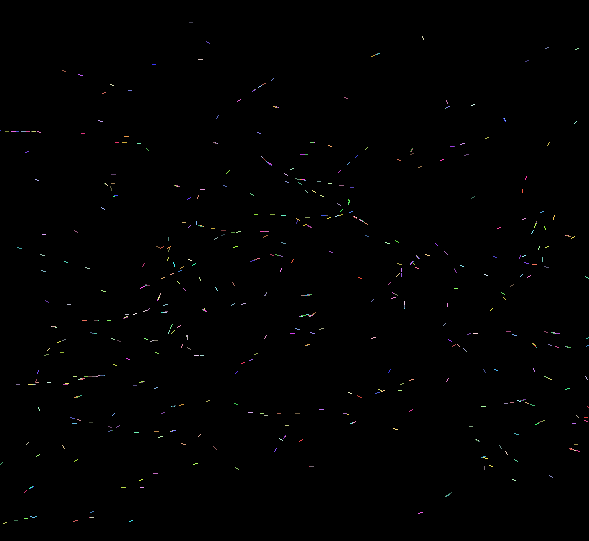
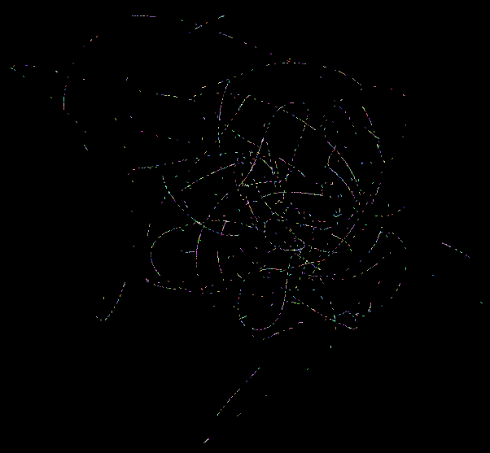
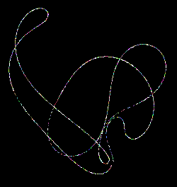
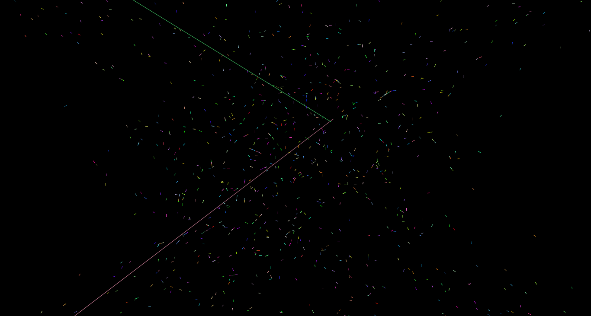

.. Copyright © 2012-2014, 2016-2017 Martin Ueding <dev@martin-ueding.de>

######################
mouse-problem-reloaded
######################

Mouse Problem
=============

There is a nice Mathematics problem called the `mouse problem`_. You start with
a :math:`n` mice, put them into the corners of a regular :math:`n`-gon and let
each mouse chase the next one (cyclic), so mouse :math:`a` chases mouse
:math:`a+1`.

I wondered how that would look like if you take a lot more mice, say 1000. If I
let them start in the corners of a 1000-gon (which is pretty much a circle),
the result would be just another set of spirals. But if I distribute them
randomly over the whole screen area, the result looks pretty interesting.

Those are three screenshots, each at different times.

    The mice (or particles) are pretty randomly distributed, but one can
    already see how they form chains.

    Now the chains are more prominent. Not all of them are long yet, but the
    direction is clear.

    And now all of the particles are in one continuous chain. If you wait
    longer, the chain will become more like a circle.

Particle Box
============

The particle box uses the same math as the mouse problem program. Only when two
particles hit each other, they are separated to the top and bottom edge of the
screen. That way, no long chains can form and the whole motion is rather
continuous the whole time

    Screenshot of the particle box program. You can see two particles being
    separated.

Download
========

- `<mouseproblemreloaded.jar>`_
- `<particlebox.jar>`_

.. _`mouse problem`: http://mathworld.wolfram.com/MiceProblem.html
